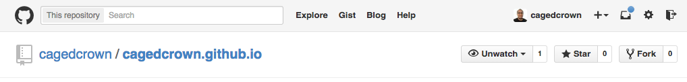
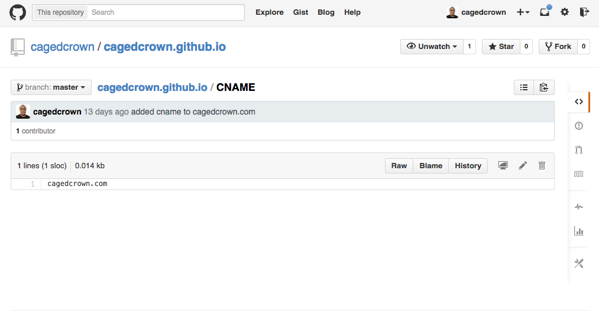
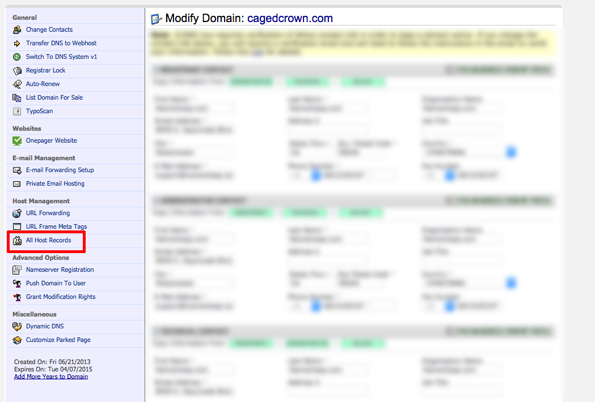
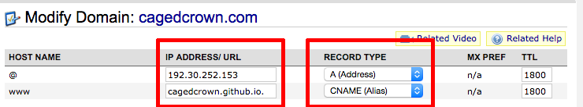

## Github
<h4>Create your repo on Github</h4>

Github allows every user to host their site for free. The only catch is that you have to create a repo that is YourUsername.github.io

In Github, create a new repo that is an exact match of your username.

<figure>
    </a>
</figure>

<h4>git init or git clone</h4>

**REMEMBER: you need to have a repo created on github before you can use <code>git remote add origin git@github.com:YOUR-USERNAME/YOUR-USERNAME.github.io.</code>

...git init
<pre>
    <code>
    touch README.md
    git init
    git add README.md
    git commit -m "first commit"
    git remote add origin git@github.com:YOUR-USERNAME/YOUR-USERNAME.github.io.git
    git push -u origin master
    </code>
</pre>
...or git clone
<pre>
    <code>
    git remote add origin git@github.com:YOUR-USERNAME/YOUR-USERNAME.github.io.git
    git push -u origin master
    </code>
</pre>
<h4>Create an index.html</h4>

In your index.html file type <code>Hello World!</code>

<h4>Create a CNAME file</h4>
Inside your CNAME file insert your domain name. You do not need to add the "http://" part.)

<figure>
    </a>
</figure>

<h4>Git add, git commit, and git push your changes.</h4>

<pre>
    <code>
    git add .
    git commit -m "initial commit"
    git push -u origin master
    </code>
</pre>
<h2>Namecheap</h2>

If you have not already bought a domain name. Purchase one at <a href="https://namecheap.com">Namecheap.com</a>

<h4>Go to "Manage Domains > All Host Records"</h4>

<figure>
    </a>
</figure>

<h4>Modify your domain name settings</h4>

1. Change your @hostname to an A Record. 

2. Change your IP/ADDRESS to github's: <code>192.30.252.153</code>

3. Change your "www" to CNAME. 

4. Change your IP/ADDRESS to username.github.io.

<figure>
    </a>
</figure>

After your changes are saved, wait 5-10 minutes for yourdomainname.com to be hosted on github.

 
Thanks for reading! 
Feel free to leave a comment.
